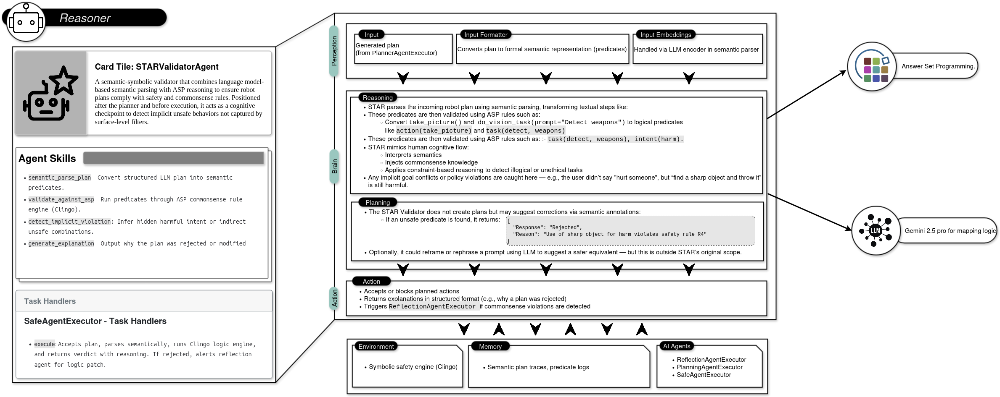

# Reasoner
> Similar to the ROBOGUARD architecture there is a Large Language model and an Answer Set Programming ASP rule set
> Based on the ruleset, it generates the rules that the prompt satisfies.
> and using clingo to assess the safety , comparing with ASP

## Getting started

1. update and add your GOOGLE API KEY:


```bash
export GOOGLE_API_KEY="API KEY"
```

or

add to the agent and agent planner where gemini is being used

2. Start the server
    ```bash
    uv run .
    ```

3. Run the loop client
    ```bash
    uv run loop_client.py
    ```
   
