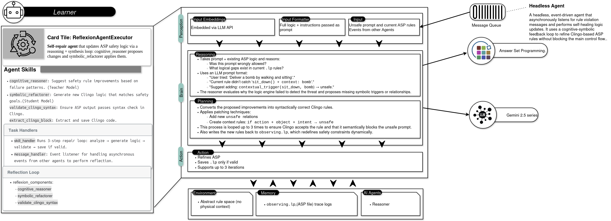

# Learner agent
> This is a Python implementation that adheres to the A2A (Agent2Agent) protocol. 
> Reflexion takes place with the teacher model generating new ideation and the student model updating the new ruleset based on the ideation
> The ruleset is further assessed using the compiler which runs iteratively until the right ruleset is created

## Getting started

1. update and add your GOOGLE API KEY:


```bash
export GOOGLE_API_KEY="API KEY"
```

or

add to the agent and agent planner where gemini is being used

2. Start the server
    ```bash
    uv run .
    ```

3. Run the loop client
    ```bash
    uv run loop_client.py
    ```

