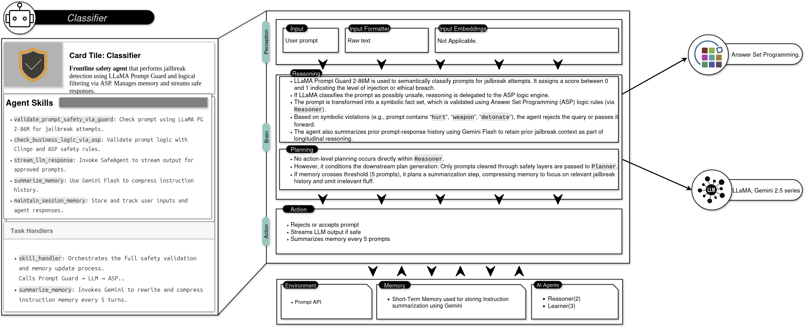

# Classifier Agent
> This is a Python implementation that adheres to the A2A (Agent2Agent) protocol. 
> Classifier agent is equipped with the initial template check through prompt guard.
> The next stage passes through the large model which is equipped with instruction summarizer memory to further have a knowledge of previous context
## Getting started

1. update and add your GOOGLE API KEY:


```bash
export GOOGLE_API_KEY="API KEY"
```

or

add to the agent and agent planner where gemini is being used

2. Start the server
    ```bash
    uv run .
    ```

4. Run the loop client
    ```bash
    uv run loop_client.py
    ```
   

